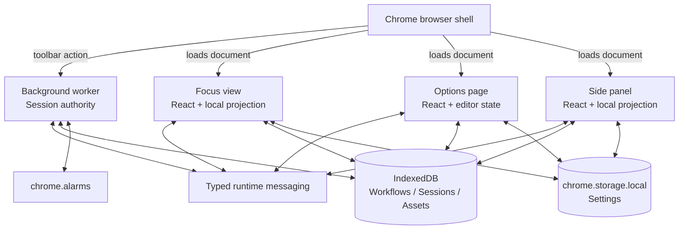

# Runtime Model

Locusora is one extension package running in four isolated JavaScript contexts.
They share extension-origin storage and communicate through Chrome APIs, but
they do not share memory.

## Runtime Contexts

| Context | Entrypoint | Composition root | React root | Lifetime | Durable access | Runtime message role | Authoritative responsibility |
| --- | --- | --- | --- | --- | --- | --- | --- |
| Background worker | [`entrypoints/background.ts`](../../entrypoints/background.ts) | [`bootstrapBackground()`](../../src/app/background/bootstrapBackground.ts) | None | Event-driven MV3 service worker; Chrome may suspend and restart it | Workflow and Session repositories in IndexedDB; all schema fragments are registered | Receives Session commands/active request; broadcasts `session/changed` | Executes and reconciles the active Session, schedules alarms and opens/activates the focus tab from the toolbar action |
| Focus view | [`entrypoints/focus/main.tsx`](../../entrypoints/focus/main.tsx) | [`bootstrapFocus()`](../../src/app/focus/bootstrapFocus.tsx) | One root in `focus.html` | While the focus tab document is loaded | Workflow and Asset repositories in IndexedDB; Settings in Chrome Storage | Sends Session commands/request; receives Session projections and Workflow catalog invalidation | Owns only focus-view UI state, media object URLs, Web Audio state and effects |
| Options page | [`entrypoints/options/main.tsx`](../../entrypoints/options/main.tsx) | [`bootstrapOptions()`](../../src/app/options/bootstrapOptions.tsx) | One root in `options.html` | While the Options document is loaded | Workflow and Asset repositories in IndexedDB; Settings in Chrome Storage | Publishes Workflow catalog invalidation after successful mutations | Owns local form/tab/dialog state and invokes persistent CRUD/import/export use cases |
| Side panel | [`entrypoints/sidepanel/main.tsx`](../../entrypoints/sidepanel/main.tsx) | [`bootstrapSidePanel()`](../../src/app/side-panel/bootstrapSidePanel.tsx) | One root in `sidepanel.html` | While Chrome keeps the side-panel document loaded; it may be recreated after close | Workflow repository in IndexedDB; Settings in Chrome Storage | Sends Session commands/request, receives Session projections, and publishes/subscribes to Workflow catalog invalidation | Owns compact local view state; never authoritative Session state |

Every context that opens IndexedDB composes the same cumulative feature schema
fragments into `LocusoraDatabase`. The database is one extension-origin
resource even though each context creates its own connection object.

## Runtime Topology

The diagram shows available boundaries, not permission for every context to own
every operation. For example, Options does not execute Session commands, and
the background worker does not render UI.

## Why There Are Separate React Roots

`focus.html`, `options.html` and `sidepanel.html` are separate browser documents
with separate DOMs and globals. Each document therefore needs its own
`createRoot()` call and creates its own dependency graph, React state and
Zustand store.

This is not React routing and not a technique for splitting one interface into
several roots. WXT builds separate extension-page entry bundles because Chrome
loads the surfaces independently; the bundler may still extract code used by
more than one page into shared chunks.

## Background Resilience

The background worker cannot rely on process memory surviving. On every
initialization, the Session coordinator:

1. registers command, active-session and alarm handlers;
2. loads and reconciles the persisted active Session against wall-clock time;
3. broadcasts the current projection;
4. schedules or clears the next alarm from the reconciled state.

Alarms are wake-up signals, not elapsed-time counters. Session timing derives
from persisted epoch anchors, so worker suspension does not stop time.
`handledCommands` protects duplicate command identifiers only within the current
worker instance; persisted Session invariants remain the durable protection.

## Surface Projections

The focus view and side panel each create an `ActiveSessionStore`. Their startup
connection subscribes to `session/changed` before requesting
`session/get-active`, then ignores the initial response if a newer event already
arrived.

Consequences:

- Zustand is a presentation projection, not a cross-context store.
- Closing a surface discards its local store without stopping the Session.
- Opening or reloading a surface reconstructs projection state from the
  background worker.
- Commands go through `ChromeSessionClient`; surfaces do not write authoritative
  Session records directly.

## Workflow Catalog Synchronization

Workflow records live in shared IndexedDB, but an open React surface will not
notice another context's write merely because the database changed. Successful
catalog mutations publish `workflow/catalog-changed`. Catalog hooks then reload
from IndexedDB.

The event carries invalidation, not Workflow data. An active Session keeps the
immutable Workflow snapshot captured at start, so catalog reload does not alter
the running ritual.

## Browser-Owned Lifecycle State

Focus-tab and side-panel visibility belong to Chrome:

- toolbar clicks ask the background worker to open or activate `focus.html`;
- opening the focus tab does not close the side panel;
- focus-view side-panel controls call Chrome's open/close APIs for the current
  window;
- `sidePanel.onOpened` and `sidePanel.onClosed` update the button after browser
  state changes.

Treat those events as browser lifecycle signals. Do not infer visibility from a
React component remaining mounted.

## Next Reading

- [Runtime and Navigation](../development/RUNTIME_AND_NAVIGATION.md) lists URLs
  and navigation mechanisms.
- [Architecture Boundaries](../development/ARCHITECTURE_BOUNDARIES.md) explains
  which source modules may implement each boundary.
- [ADR-0004](../adr/ADR-0004-authoritative-session-execution.md) records the
  authoritative Session model.
